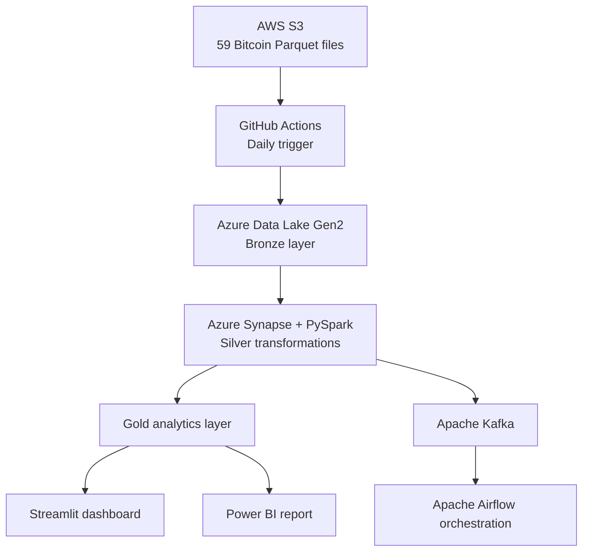
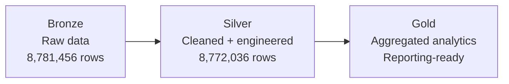
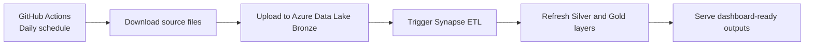

> **🔗 Project Links**  
> **🐙 [GitHub Repository](https://github.com/Mubashirdev09/bitcoin-blockchain-etl-pipeline)**  
> **🚀 [Live Dashboard](https://btc-etl-live.streamlit.app/)**

## Impact

- Processed 8.7 million Bitcoin transactions from 59 public Parquet files.
- Built a daily automated workflow for ingestion and transformation.
- Reduced raw blockchain data into a compact Gold layer for reporting.
- Identified 2017 as the peak fee year, with average fees reaching 3.22%.
- Measured 484% transaction growth from 2013 to 2017.
- Showed that fee percentage had almost no correlation with transaction value alone, pointing instead to network congestion as the stronger driver.

## Problem

Public Bitcoin blockchain data was available, but it was not structured for practical analysis by investors or non-technical users. The challenge was to transform high-volume raw files into a reliable analytics pipeline that could explain fee behavior, transaction growth, and congestion patterns over time.

## Architecture

The pipeline begins with public Bitcoin Parquet files stored on AWS S3. A scheduled GitHub Actions workflow triggers ingestion, Azure Data Lake Gen2 stores the Bronze layer, Azure Synapse with PySpark transforms the data into Silver and Gold layers, and the final analytics outputs are delivered through Streamlit and Power BI.

## Medallion Layers

I used Medallion Architecture to keep raw, cleaned, and reporting-ready data separate. This made the workflow easier to debug, easier to extend, and better suited for both engineering use and lightweight dashboard delivery.

## Automation Flow

The ingestion process runs on a daily schedule and updates the analytics workflow with minimal manual effort. That made the project feel closer to a production-style pipeline than a one-time batch exercise.

## What I Built

- Ingested 59 Parquet files containing 8.7 million Bitcoin transactions from AWS S3.
- Implemented Bronze, Silver, and Gold layers in Azure Data Lake Gen2.
- Built PySpark transformations for cleaning, feature engineering, and yearly aggregation in Azure Synapse.
- Added GitHub Actions for scheduled daily pipeline triggers.
- Used Kafka and Airflow to simulate streaming and orchestrate workflow tasks.
- Published analytics outputs through a public Streamlit dashboard and a Power BI report.

## Key Engineering Decisions

I used Azure for storage and transformation while sourcing the data from AWS S3 to demonstrate cross-cloud data movement without fragmenting the analytics workflow. I also adopted Medallion Architecture so raw data could be preserved, transformations could stay modular, and reporting outputs could remain lightweight.

Publishing both Streamlit and Power BI was a deliberate product decision. Streamlit made the project easy to share publicly and extend in Python, while Power BI made the insights easier to consume in a more familiar BI format.

## Results

| Metric | Result |
|---|---|
| Transactions processed | 8.7M |
| Bronze layer rows | 8,781,456 |
| Silver layer rows | 8,772,036 |
| Automation | Daily scheduled pipeline |
| Peak fee year | 2017 |
| Peak average fee | 3.22% |
| Transaction growth | 484% from 2013 to 2017 |

## What I Learned

This project reinforced the value of layered pipeline design instead of transforming raw data directly into dashboard outputs. It also showed that technical projects become stronger when infrastructure decisions are tied to a clear analytical question and delivered in a format that non-technical users can understand.

---

**🐙 [GitHub Repository](https://github.com/Mubashirdev09/bitcoin-blockchain-etl-pipeline)**  
**🚀 [Live Dashboard](https://btc-etl-live.streamlit.app/)**